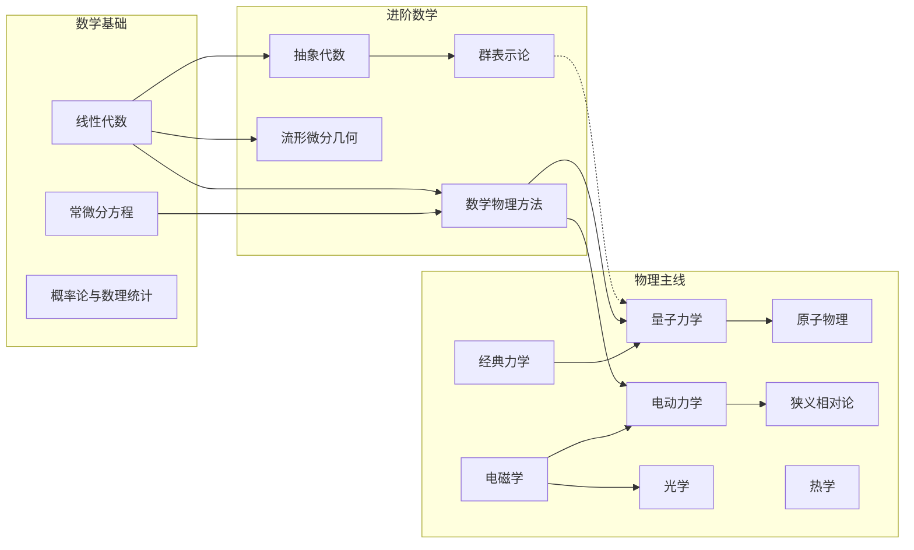

# RongYu's Notes 个人网站评审与改进建议

> **Site Review and Redesign Prospectus** · 数学 · 物理 · 爵士：一处“乐谱归档”的现状审视与再设计蓝图

**作者：** Claude Code · **对象：** RongYu221104.github.io（独立评审，不改动线上文件）· **日期：** 2026 年 7 月 31 日

---

## 目录

- [第一部分 · 值得一直贯彻的地方](#第一部分--值得一直贯彻的地方)
- [第二部分 · 剩余建议清单（10 条）](#第二部分--剩余建议清单10-条)

---

## 第一部分 · 值得一直贯彻的地方

> 这个站点的底子很好。下面几件事不仅做得好，而且是整站的辨识度所在——它们应该被一直贯彻下去，后续所有改动都顺着这些气质延伸，而不是推翻重来。

### 乐谱与唱片的隐喻，要一直贯彻下去

这是本站最独特的地方，也是后续所有建议都应顺着它一路延伸的原因：**整站以“乐谱与唱片”为隐喻，并且贯彻到了每一个细节。**

- 首页副题是 `Mathematics · Physics · Jazz`；
- 讲义目录页标注 `LaTeX archive · 19 scores`，讲义被称作“谱”；
- 数学与物理两栏分别叫 `Side A` 与 `Side B`，呼应唱片的 A 面 / B 面；
- 首页大图角落印着 `RY · 2026` 的印刷式页签；
- 404 页自称 `Outtake`——未收录的录音花絮；
- 页脚收在“数学、物理与一点爵士乐”。

这些编号并非装饰，而是*编码了真实结构*：A/B 对应两门学科，“谱”对应讲义。因此每一条改动建议，都先问一句：“它还像一处乐谱归档吗”。

### 排版与字体各司其职

中西混排由四类字体各司其职：Cormorant Garamond 承担西文展示，方正清刻本悦宋承担中文标题，Noto Sans SC 负责正文，IBM Plex Mono 读元数据（页数、日期、编号）。层级一眼可辨；中文标题字体还是自托管的——这份投入应该一直保留下去。

### 配色克制而有记忆点

porcelain / ink / wine / brass 四色构成低饱和的“纸质印刷”气质，与爵士乐的黑胶、乐谱纸的意象吻合。强调色 wine 与 brass 用得很少，反而每次出现都很有效——这个“克制”的用法值得一直贯彻：宁可少用，也不要堆砌。

### 无障碍与响应式扎实用心

无障碍方面，跳过链接、焦点环（`:focus-visible`，键盘操作时可见的聚焦框）、语义化标签（`article` / `section` / `time`，让读屏软件理解页面结构）、ARIA 状态（给辅助技术读的页面状态）、图片 `alt`（替代文字）、`prefers-reduced-motion`（用户开启“减少动画”偏好后自动减弱动效）全部就位。响应式方面，移动端把导航收敛成底部三格，页脚主动避让。这些“地基”级别的投入超过了绝大多数个人站点，应该继续。

### 性能与隐私意识先行

性能上，hero（首屏大图区）背景图提供 1920/3840/7680 三档 `srcset`——不同屏幕取不同分辨率，不必一张大图打天下；字体用 `font-display: swap`——字体加载完之前先用系统字体顶上，文字不出现空白；音频 `preload="metadata"`——先只加载时长等元信息，播放时才真正加载声音。隐私上，三个工具全部在浏览器本地处理：RYplan 的数据存本地、workspace-viewer 只读本地目录授权、DocBridge 不上传文档。在“默认上传云端”成为惯例的当下，这个“本地优先”的立场值得一直坚持。

---

## 第二部分 · 剩余建议清单（10 条）

> 已完成的建议已从清单移除；其余建议保留原编号。每条先说为什么值得做、再讲具体怎么做；遇到计算机术语时保留英文原词（更准确），并在后面用大白话解释清楚。

### 建议 1：「正在读 / 正在放」状态条

**为什么：** 现在的首页更像“陈列”，不像“活着的站点”。加一行“正在读什么、正在放什么”的状态，访客一眼就知道这个站最近在动，而不是建好就没人管的归档。这行字像演出海报上的“本场曲目”，非常贴合乐谱隐喻。

**怎么做：** 在首页 hero 下方或页脚加一行文字，例如：`正在读：量子力学 · 第 4 章 角动量`，旁边接一句 `上一张唱片：Kind of Blue · So What`。

**落点与术语：** 把这一行字单独存进一个数据文件 `data/now.ts`——通俗说就是一个只存两行字的配置文件，想改状态时打开改两行字，首页就跟着变，不用动页面代码。日后若与 RYplan（你的计划管理工具）打通，这行状态可以直接取当天计划，等于给工具页导流。

### 建议 2：「演奏程序单」学习路线图

**为什么：** 现在 19 份讲义按“学习 / 课程 / 复习”分类陈列，像一只文件柜，摆得整齐，但新访客最关心的问题是：**我该从哪一份读起？**

**怎么做：** 新增一页 `/study/`，把讲义按依赖关系排成一张“演奏程序单”：数学基础 → 进阶数学 → 物理主线，每份讲义是一行曲目，用箭头标出“先修”关系——读 A 之前最好先读过 B。下图是一张构想示例。

> 实线箭头表示建议的先修顺序，虚线箭头表示“群表示论在量子力学对称性中的应用”。热学与概率论相对独立，可随时插入。

**落点与术语：** 数据可以仿照 `src/data/lectures.ts`（讲义清单数据文件）写进独立文件，由页面渲染成可交互的图。这条需要你确认学科先修顺序（个人内容，需要你提供素材）。

### 建议 3：版本注记与勘误

**为什么：** 讲义会不断更新，但读者看不到“这一版改了哪里”，也没有地方反馈“我发现了一处错误”。这在学术内容里很伤信任。

**怎么做：** 做两件事——

1. 每份讲义配一条**变更日志**（本版更新了什么），目录里最近更新过的讲义挂一个“更新”小徽标；
2. 加一个**勘误入口**：读者能在页面上留言，或在仓库（GitHub 代码库）提 issue（问题单），站点设一页 `/errata/` 把勘误按讲义汇总展示。

**落点与术语：** 目前讲义清单里有 `updatedAt` 字段（每条讲义标注的“最近更新时间”），是手工填的，容易忘改。更好的做法是发布时自动取真实时间（见建议 14），“最近更新”就永远可信。

### 建议 8：“午夜场”深色模式

**为什么：** 深色模式容易做成“黑底 + 单亮色”的模板答案。这里应该顺着既有色板做**同一色系的明暗反转**：保留 porcelain 系的低饱和绿调，只把底色变深、文字变浅、强调色提亮，保证对比度。深夜读讲义不刺眼。

**怎么做：** 把 `global.css` 的 `:root` 变量整理成两套（“晨曦”和“午夜”），一键切换并记住用户的选择。下表给出了构想中的两套配色值。

| token | 晨曦（现状） | 午夜（构想） |
|---|---|---|
| 页面底色 | `#f5f8f7` | `#121a19` |
| 卡片/面板 | `#fbfdfc` | `#1b2624` |
| 正文色 | `#1e2b2a` | `#e6eeec` |
| 次要文字 | `#4d5d59` | `#9db0ab` |
| wine 强调 | `#7d3345` | `#c98da1` |
| brass 强调 | `#b89a57` | `#d5bb7d` |
| 分隔线 | 深色 18% | 浅色 22% |

**术语解释：** CSS 变量（`:root` 里定义的颜色代号）——全站所有颜色都从这些代号取，改一处、全站跟着变，做成两套代号就能一键换肤；token 是设计系统里给颜色起的规范名字；`localStorage` 见建议 5——这里用来记住“用户选了哪套配色”。

### 建议 10：打印样式

**为什么：** 个人站点最容易忽视的就是打印。讲义本来就是给人读的，目录打出来应该清爽。

**怎么做：** 为讲义目录加一份打印样式，让 `/latex/` 和 `/study/`（建议 2）打印出来是一份干净的“节目单”。

**术语解释：** `@media print` 是 CSS 里专门管“打印”的规则——屏幕上用一套样式，打印时换另一套，可以把导航、配色这些屏幕元素收掉，只留清爽的内容。

### 建议 13：性能整理

**为什么：** 几个性能细节属于低风险优化，做了之后加载更快、滚动更流畅。

**怎么做：** 四件事——

1. 工具预览图（2560×1440）从“首屏急切加载”改为“滚到才加载”，并输出更小的新一代图片格式；
2. 音乐目录从“每个页面都内嵌”改为“展开时才渲染”；
3. 背景原图下载入口收敛到压缩版；
4. 为站内链接开启预取（`prefetch`）。

**术语解释：** `loading="lazy"` 是图片“延迟加载”属性——图片滚动到视口附近才下载，首屏更快；WebP / AVIF 是比 JPEG / PNG 更省体积的图片格式；“每页内嵌”指曲目数据被复制进了每个页面的 HTML（网页的结构文件）里，改成按需请求就能让每页更小；`prefetch` 预取——鼠标接近某个链接时提前把目标页面下载好，点击瞬间就打开。

### 建议 15：sitemap 与 RSS 预留

**为什么：** 搜索引擎靠站点地图来发现站内所有页面；有了它，“量子力学讲义 PDF”这类具体搜索词（长尾词）才更可能被搜到。

**怎么做：** 接入 `astro-sitemap` 生成 `sitemap.xml`，并预留 RSS 路由。

**术语解释：** `sitemap.xml` 是站点地图文件，罗列全站页面地址，帮助搜索引擎完整收录；RSS 是一种订阅格式——读者用 RSS 阅读器订阅后，站点一更新就能收到，不必天天来刷。若日后新增笔记博文（建议 16），RSS 顺手就能接上。

### 建议 16：从“归档”到“乐谱架上的排练稿”

**为什么：** 现在的讲义是 PDF，适合打印，却不利于分享、检索与订阅。

**怎么做：** 长期看可以用 Astro 的 content collections（内容集合）把一部分内容以页面形式发布：PDF 作为“正式演出版”，页面作为可搜索、可链接、可订阅的“排练稿”。

**术语解释：** content collections 是 Astro 框架提供的内容管理功能——把讲义内容当结构化数据管理，自动生成页面。这与建议 3 的勘误、建议 15 的 RSS 天然衔接，是站点从“工具集”走向“个人出版物”的方向。

### 建议 17：PWA 离线阅读

**为什么：** 手机上把站点“装进口袋”，通勤没网时也能离线翻讲义。你的工具全部本地优先，PWA 和这一理念天然一致。

**怎么做：** 给讲义阅读器（建议 5）加一个 Service Worker 缓存，并把站点做成可安装到手机主屏幕的应用。

**术语解释：** PWA 是“渐进式 Web 应用”——本质还是网页，但能像 App 一样安装到手机、离线可用；Service Worker 是一个常驻浏览器的小程序，负责把页面和讲义缓存到本地，没网时直接读缓存。

### 建议 18：与 RYplan 闭环

**为什么：** RYplan 管计划，讲义目录管资料，阅读器管进度——三者目前各管一摊，互不相通。打通之后，站点从“三个工具”变成“一个学习系统”。

**怎么做：** 让 RYplan 的备份文件里能引用讲义（比如 `{"lecture": "Stu_QM"}` 这种条目），首页状态条（建议 1）直接取当天的学习计划。

**术语解释：** JSON 是一种通用的数据存储格式（结构是 `{字段: 值}`），RYplan 的备份文件就是 JSON——在里面加一个“引用哪份讲义”的字段，就能把计划和讲义连起来。
